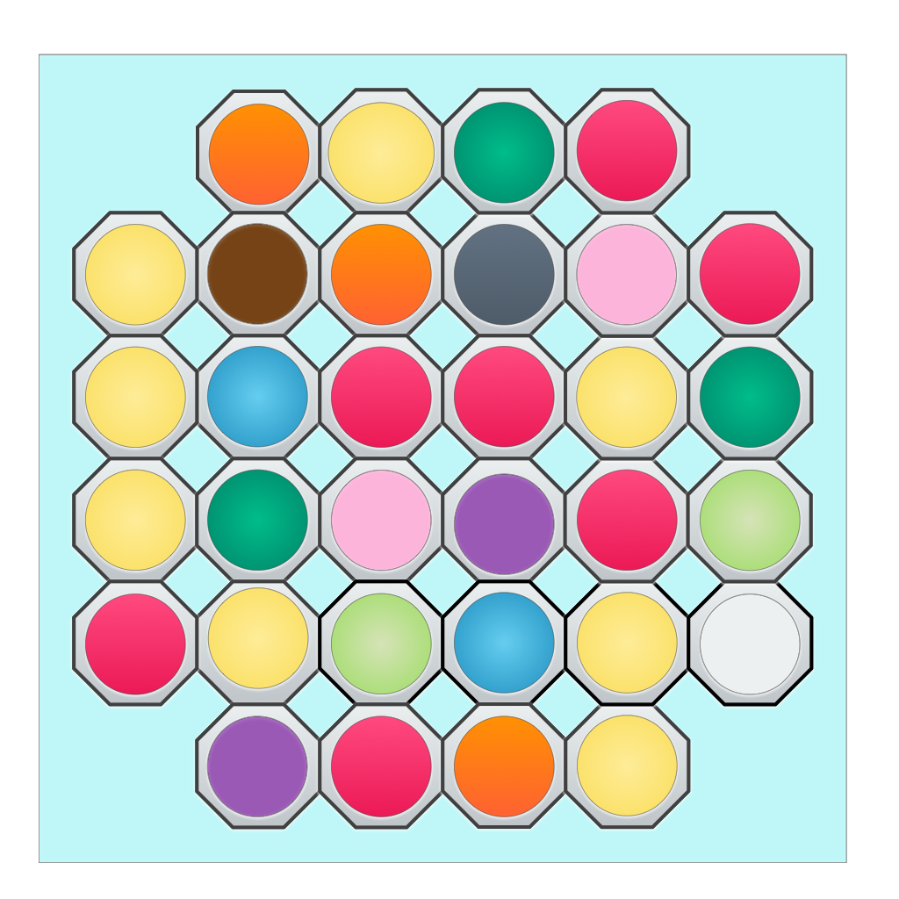
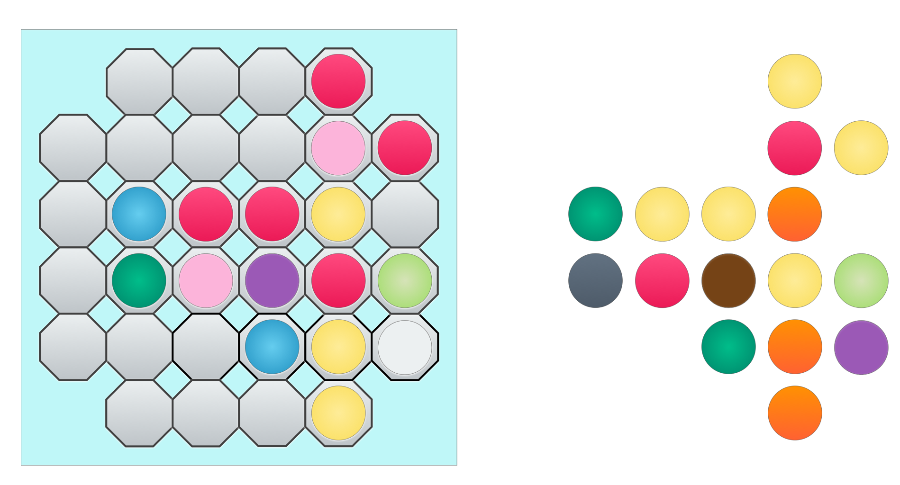
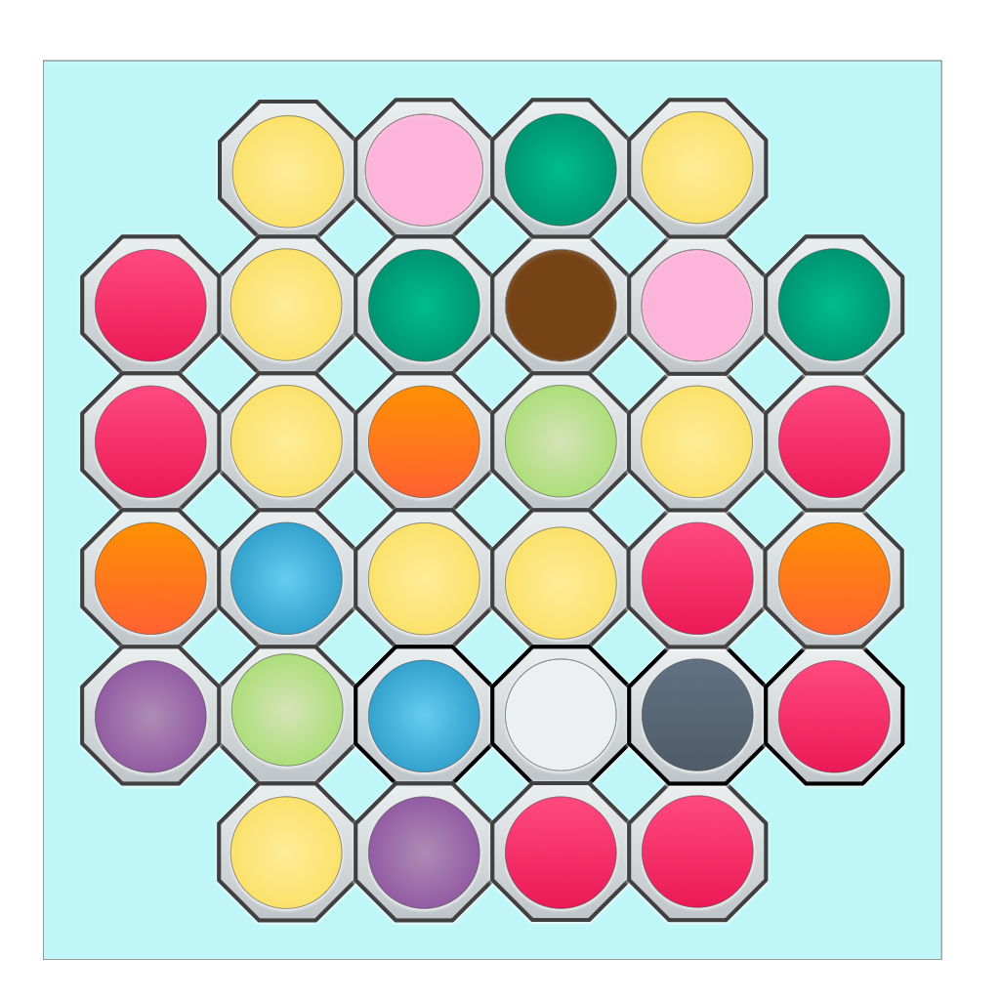
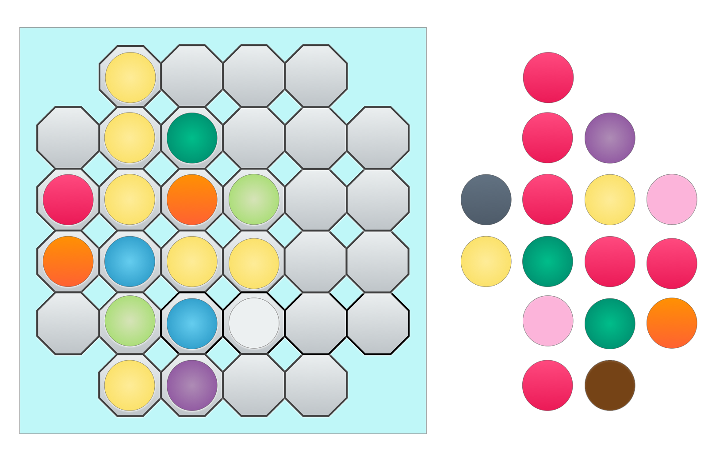
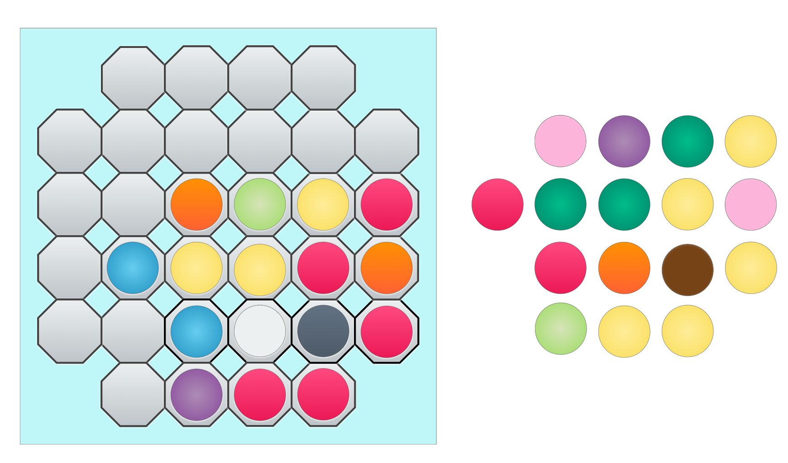
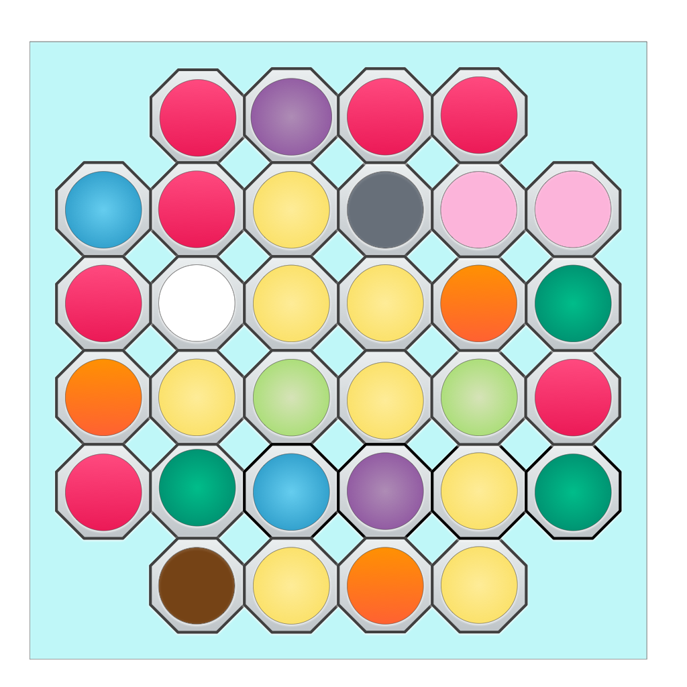
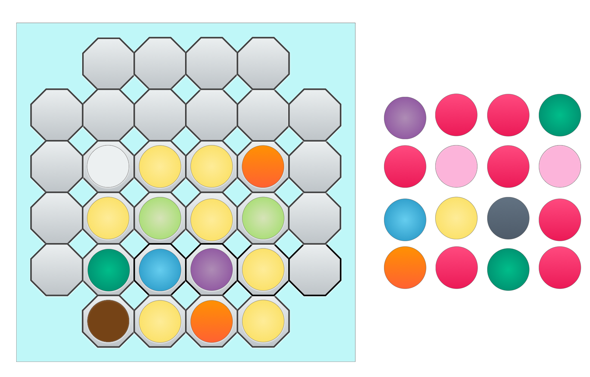

## Solitaire Abstract Games

#### Part 1: MeM

##### .... a most beautiful objective.

I was introduced to MeM back in 2000, when I corresponded with David Pritchard, legendary editor of _Games and Puzzles_ magazine and writer of _The Encyclopedia of Chess Variants_. David wrote, “MeM is both a subtle and difficult game which requires great foresight to play well.  It is also (a big bonus, in my opinion) visually and aesthetically pleasing.” I find MeM to be an astounding game, because of its goal, which is unusual and attractive. Subsequently, I published David’s article on Mem in Issue 2 of _Abstract Games_ magazine—trusting in David’s judgement and without actually playing the game myself. Seventeen years later, I constructed a MeM set, and started to investigate. 

I have yet to play the two-player game, and so my comments are limited to the solitaire. We will return to MeM in a later issue, with a full evaluation of the main game, which is for two players. Nevertheless, the solitaire game alone has  interesting features, and quite adequately illustrates the genius of the MeM design.

Pritchard writes, MeM was designed by Anatol W. Holt Hopfenberg, and first published in 1968 by Stelledar of Philadelphia. The name originates from the French _même_, meaning the same, referring to the relationship between patterns of pieces. Das Spiel of Hamburg later republished the game as Imago in 1996, and then Kadon Enterprises reissued it as Imago Deluxe in 2002. According to the Kadon website,[^1] Hallmark also published a version in the 1980’s, but there are no details. The BoardGameGeek page[^2] has some further information, although coverage of MeM is scant.

Original copies of any version of MeM are difficult to find. Fortunately, the game is easy to construct, where the main difficulty is finding pieces in a large  enough variety of quite distinct colours. 

The MeM board is a 6x6 square grid, with the corners removed, consisting therefore of 32 spaces. You will need 32 pieces of eleven different colours, of a size to fit snuggly into the board squares. The distribution of colours is as follows: 8, 7, 3, 3, 2, 2, 2, 2, 1, 1, 1, meaning that there are eight pieces of one colour, seven pieces of a second colour, and so on.

I designed a board and used commercial photofinishing to print the image on an aluminum panel. The glossy metal finishing has a nice, solid feel to it. For the pieces, I decided to use buttons, because I could find buttons of the right size in eleven different colours. Unfortunately, buttons, typically used for clothes not games, tend mostly to be manufactured in drab colours—my game set was unattractive, and the colours were insufficiently distinct. I wanted the game to look good and be easily playable in imperfect light. I painted the plastic buttons with bright acrylics and finished them with varnish. The resulting set is attractive, and the pieces click pleasurably on the metal board. To my mind, the sensual aesthetic of the playing experience is important. My constructed set is shown in the image in the header of this article.

To start with, the 32 pieces are placed randomly on the 32 spaces. The diagram below shows a typical starting position.

The  solitaire rules are simple. One by one, remove pieces from the board and place them in a play area close to the board. After the first piece, each piece removed must be placed in the space off the board orthogonally adjacent to a piece taken off previously. The key requirement is that the pattern of pieces off the board must continue to match at least one pattern of pieces still on the board.

The pattern-matching requirement is very clever, and this is what it means. Firstly, the shapes of the matching patterns must be identical. Secondly, any two pieces in the pattern off the board are the same colour _if and only if_ the corresponding two pieces in the matching pattern on the board are also the same colour. Particular colours do not need to match, only relationships between corresponding pairs of pieces, on the board and off the board, whether they have the same colour or not. The way that I like to think of it is that there is a _shape-colour isomorphism_ between the pieces off the board and the pieces on the board. The goal is difficult to describe in words without using mathematical language, but it is really easy to understand once you start looking at concrete examples. I will show some examples below. 

For the solitaire game, a winning position is reached when 16 pieces have been removed from the board in an isomorphic (i.e., matching) shape-colour pattern to the 16 pieces remaining on the board. Here is an example of a winning position, resulting from the starting position above:

You can see that the pattern of five red pieces on the board matches the pattern of the five yellow pieces  off the board; on the other hand, the pattern of the three yellow pieces remaining on the board matches the pattern of the three orange pieces off the board; two reds off the board correspond to two pinks on the board; and so on, and so forth.

Incidentally, you may already see that the board itself is not strictly necessary. All you need to do is to arrange the pieces initially into the 6x6 shape with the corners removed. This makes the game highly portable, where all that is required is a little bag of coloured buttons.

When first trying this game, I thought it was very tough. I would start taking pieces off the board and scan for patterns remaining that could match. I soon realized that a strategy was possible to greatly simplify the planning. For example, there are very few ways the colour with eight pieces (in my set and the diagrams, yellow) can be split between the two patterns. The largest conglomeration of the eight-piece colour must match a grouping of the seven-piece colour (in my set and the diagrams, red) in the opposite pattern.

For example a 4-4 split of the yellows is not possible. Each of the fours must correspond in its opposing pattern to four pieces of the same colour. These four pieces must be red, because otherwise the largest number of pieces with one colour is three. But there are only seven red pieces, and it is impossible to split them 4-4! Likewise, obviously, the yellows cannot be split 8-0. Therefore, the yellows can be split only as 7-1, 6-2, or 5-3.

There are 22 ways in which the pieces can be split between the colours, as shown in the list below. The first digit in a pair represents the number of pieces of that colour remaining on the board; the second digit represents the number of pieces of that colour off the board—or vice versa. We do not need to include the singletons, as they will fall where they need to to balance the two patterns.

> 5-3, 2-5, 3-0, 1-2, 2-0, 0-2, 2-0, 0-2
> 5-3, 2-5, 3-0, 1-2, 2-0, 0-2, 1-1, 1-1
> 5-3, 2-5, 3-0, 1-2, 1-1, 1-1, 1-1, 1-1
> 5-3, 2-5, 3-0, 2-1, 0-2, 0-2, 2-0, 0-2
> 5-3, 2-5, 3-0, 2-1, 0-2, 0-2, 1-1, 1-1
> 6-2, 1-6, 3-0, 0-3, 2-0, 2-0, 0-2, 1-1
> 6-2, 1-6, 3-0, 0-3, 2-0, 1-1, 1-1, 1-1
> 6-2, 1-6, 2-1, 1-2, 2-0, 2-0, 0-2, 1-1
> 6-2, 1-6, 2-1, 1-2, 2-0, 1-1, 1-1, 1-1
> 6-2, 1-6, 2-1, 2-1, 0-2, 0-2, 2-0, 1-1
> 6-2, 1-6, 2-1, 2-1, 0-2, 1-1, 1-1, 1-1
> 6-2, 1-6, 1-2, 1-2, 2-0, 2-0, 2-0, 1-1
> 7-1, 0-7, 3-0, 0-3, 2-0, 0-2, 2-0, 0-2
> 7-1, 0-7, 3-0, 0-3, 2-0, 0-2, 1-1, 1-1
> 7-1, 0-7, 3-0, 0-3, 1-1, 1-1, 1-1, 1-1
> 7-1, 0-7, 2-1, 1-2, 2-0, 0-2, 2-0, 0-2
> 7-1, 0-7, 2-1, 1-2, 2-0, 0-2, 1-1, 1-1
> 7-1, 0-7, 2-1, 1-2, 1-1, 1-1, 1-1, 1-1
> 7-1, 0-7, 2-1, 2-1, 0-2, 0-2, 2-0, 0-2
> 7-1, 0-7, 2-1, 2-1, 0-2, 0-2, 1-1, 1-1
> 7-1, 0-7, 1-2, 1-2, 2-0, 2-0, 2-0, 0-2
> 7-1, 0-7, 1-2, 1-2, 2-0, 2-0, 1-1, 1-1

With this knowledge, suddenly the game becomes considerably easier. In fact, almost every time the game can be won, by forming the matching patterns of 16 pieces on the board and 16 pieces off the board. I do not mean that the list needs to be memorized, just that it illustrates the type of thinking necessary to be successful. Bear in mind that the most common error, and path to failure, is where a piece that must stay on the board (for some pattern matching necessity)  becomes isolated from the main group of pieces—the final patterns on the board and off the board must be orthogonally connected.

Thus, review the initial setup, looking for conglomerations of pieces. The final pattern on the board will have either five to seven yellow pieces or five to seven red pieces—these are the only possibilities. With six yellow pieces remaining on the board, for example, there must be six red pieces off the board to match them, and then the remaining two yellow pieces must be off the board, and the remaining red piece must be on the board. The collection of six yellow and one red piece on the board are best grouped close together, to reduce the possibility of isolating a piece. Once you have decided the overall strategy with respect to the yellow and red pieces, you can start removing pieces from the board that you know must come off. Then, you will need to decide how to split the two sets of three-colour pieces. 

I have said enough about strategy, and the rest will become obvious with a little practice. With concentration and care, you ought to be able to win every game.

The amazing thing is, MeM remains enjoyable even though you know you can win every game. The type of thinking required is in itself pleasurable, and supplies  a mental exercise akin to that of solving cryptic crosswords—the experienced solver engages the puzzle every morning, knowing that he or she will probably complete it before too long. Or perhaps a better example is the pleasure of continuing to play with a Rubic’s Cube, even when you know how to solve it. Moreover, I find the relationship between the two final patterns to be inherently beautiful. The connection between the two patterns preserves shape and the colour-identity relationships, but not individual colour relationships—a shape-colour isomorphism.

Arguably, the goal in MeM is the most beautiful goal in all of abstract gaming. According to Pritchard, Alex Randolph, inventor of Twixt among other classic abstracts, considered ”MeM to be the very best abstract game in the world.”[^3]

I do not refer here yet to the two-player game, but the solitaire alone. Nevertheless, the key concept relating patterns of pieces is present throughout all versions of MeM, and it is this concept, which defines the goal, that is so brilliant.

You may enjoy playing around with buttons, as I have described, with no further amendments to the game. Nevertheless, there are ways to make MeM solitaire continually challenging. Usually, a MeM starting position will offer multiple possible complete solutions. Let us decide that the more compact solutions are more desirable, where the compactness of a solution is measured by the size of its perimeter. Consider the following starting position:

Here is one solution, with perimeter size 20:

Here is a second solution, with perimeter size 18:

The perfect solution, would involve two 4x4 patterns, with perimeter 16. A perfect solution is not always possible. Here below is a  puzzle, to construct a perfect solution. Note that the solution is not unique. 

Where do we go with MeM and its beautiful objective? One of my favourite books is Herman Hesse’s _The Glass Bead Game_, in which an intellectual elite play a game of the same name. According to Wikipedia,  “It proceeds by players making deep connections between seemingly unrelated topics.”[^4] There have been at least two attempts previously to develop a “glass bead game” boardgame. In
The Domino Bead Game, from  Sid Sackson’s _The Gamut of Games_, began as an attempt to recreate the “glass bead game.” And then Christian Freeling's game is explicitly named The Glass Bead Game. Neither of these games comes close to Hesse’s conception, and to be fair, their designers make no claims in this regard. Nevertheless, to my mind the goal of MeM comes closer than any other to Hesse’s conception, and MeM itself may be regarded as the first interpretation of the “glass bead game.” The relationship between the pattern off the board and the pattern on the board is akin to the relationship in _The Glass Bead Game_ between the composition represented in the game itself and its context in the wider world of ideas. Would the _real_ “glass bead game”, closer to the conception of Hesse’s iconic book, borrow ideas from MeM?

#### Solution

[^1]:	Kadon Enterprises page about Anatol Holt Hopfenberg:
	[http://www.gamepuzzles.com/anatol.htm](http://www.gamepuzzles.com/anatol.htm)

[^2]:	BoardGameGeek MeM page:
	[https://boardgamegeek.com/boardgame/1047/mem](https://boardgamegeek.com/boardgame/1047/mem)

[^3]:	Eamon Bloomfield in BoardGameGeek:

	[https://boardgamegeek.com/thread/626898/mem-i-was-shown-30-years-ago](https://boardgamegeek.com/thread/626898/mem-i-was-shown-30-years-ago)

[^4]:	Wikipedia article on Hesse’s The Glass Bead Game:
	[https://en.m.wikipedia.org/wiki/The\_Glass\_Bead\_Game](https://en.m.wikipedia.org/wiki/The_Glass_Bead_Game)